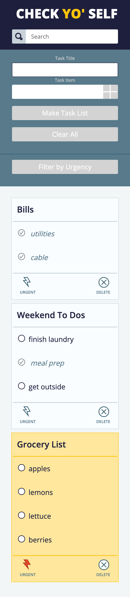

# Check Yo' Self

### By: Alyssa Lundgren

## Introduction
Check Yo' Self, a To-Do and Task List making app, allows users to input their To-Dos and associated Tasks Lists and then displays them on the page's left side To-Do Board. The program utilizes localStorage to persist user's data across browsing sessions allowing them to indicate To-Dos as urgent, mark Tasks as completed, delete completed To-Do lists, search by the To-Do's title, and filter by To-Dos Urgency status. 

## The Project and My Process
Check Yo' Self was a true amalgamation of the things I have learned since beginning my journey at Turing School of Software and Design, taking an appliation concept, user storires, and provided comp and developing the HTML, CSS, and JavaScript to get the program launched in a short period of time (less than one week). The JavaScript includes examples of 'for' loops and array prototype methods implemented to sort through arrays of To-Do objects as well as Task objects stored within the To-Do object. The program implements both DOM manipulation as well as utilizing JSON.parse() and JSON.stringify() to deliver data to localStorage and back allowing the information implemented on the DOM to persist. The application's body was built with CSS Grid with CSS masonry utilized within the To-Do-Board. This was a solo project acting as my Mod 1 Capstone Project. 

## Reflection
I found the development of Check Yo' Self both challenging and rewarding. I enjoyed working through a project indiviually as well as utilizing discussion with my fellow classmates to progress and guide development. This was my first utilization of filter or search functionality and it was enjoyable to learn and implment those new skills. Overall, I am proud of the outcome and anyone who knows me knows I love making lists and now, I've made an app for that.

## Screenshots
### Full Screen

### Mobile Layout

